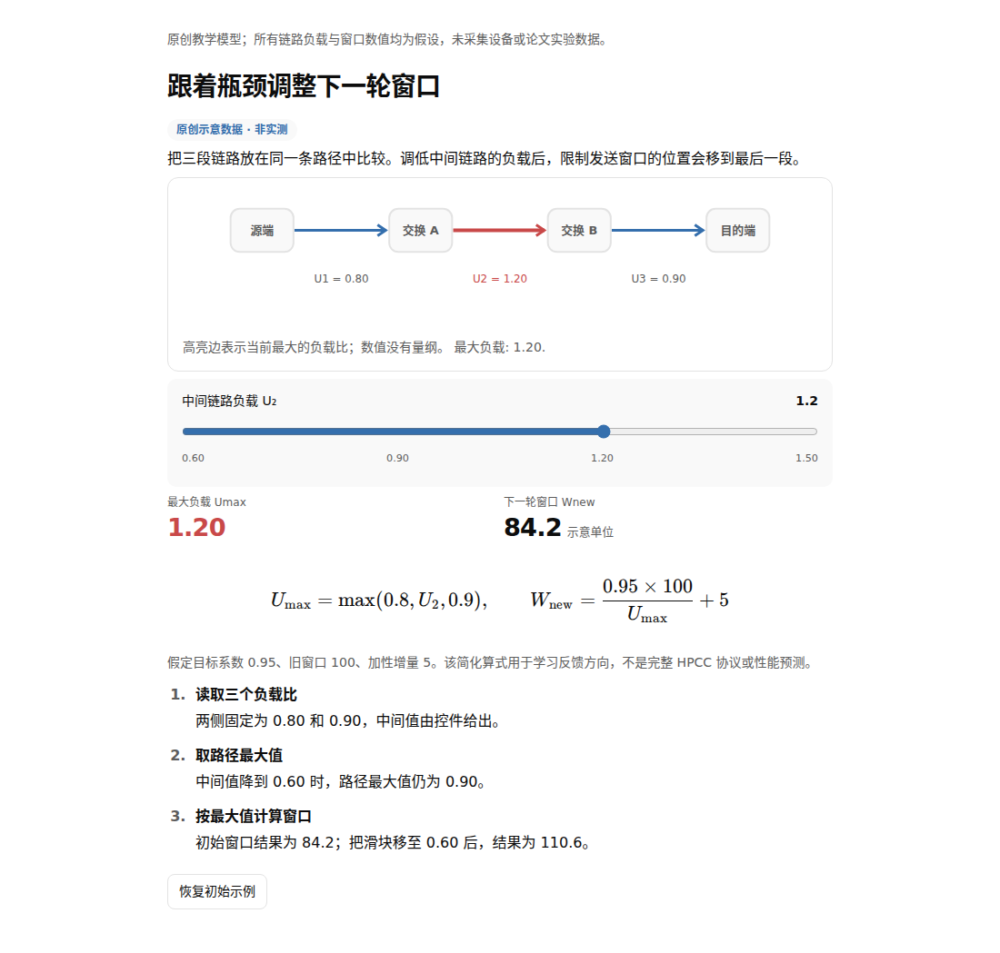
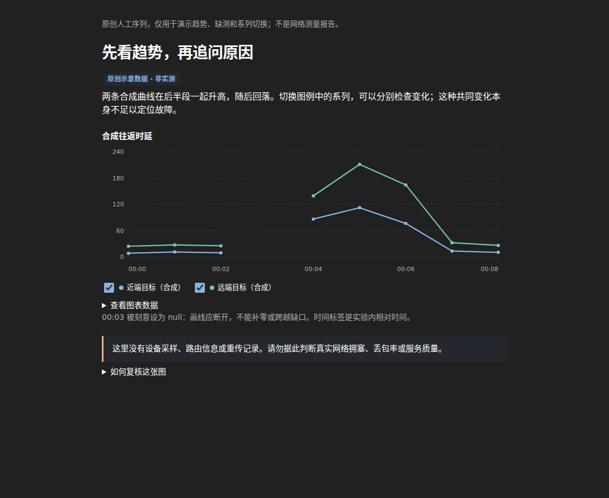

<h1 align="center">Intelligent-UI</h1>

<p align="center"><strong>让简短的 JSON，变成可阅读、可交互的科学解释。</strong></p>
<p align="center">正文 · 公式 · 图表 · 拓扑 · 联动控件</p>

<p align="center">
  <a href="https://github.com/Micraow/Intelligent-UI/actions/workflows/ci.yml"></a>
  <a href="LICENSE"></a>
  <a href="tsconfig.json"></a>
  <a href="package.json"></a>
</p>

<p align="center">
  <a href="#快速开始">快速开始</a> ·
  <a href="#一套库两种用法">两种用法</a> ·
  <a href="#示例">示例</a> ·
  <a href="#文档">文档</a>
</p>

Intelligent-UI 是一套 **独立、开源的 JavaScript / TypeScript 界面库**。模型、应用或人只需提供结构化内容，库负责排版、公式、图表与交互。适合技术说明、教学演示、研究笔记，以及需要图文混排的 AI 回答。

**不需要 OpenAI 账号、API、服务或运行时。** 同一套库既能生成离线 HTML，也能嵌入你的网页。项目追求克制、清晰的编辑式科学表达。

## 看看效果

下面是本库从原创 JSON 生成的真实浏览器截图。拖动示例中的滑块，链路瓶颈与窗口数值会一起更新。

<p align="center">
  
</p>

<details>
<summary>查看深色模式与 RTT 图表</summary>
<br>
<p align="center">
  
</p>
</details>

截图中的数据均为示意，不是设备实测。图片来自本项目的合成示例与 Chromium 测试，未使用原版网站截图。[截图来源](docs/assets/README.md)

## 能做什么

- **自然的图文混排**：标题、正文、说明、卡片、列表、表格与步骤使用一致的排版和间距
- **科学内容表达**：带内置数学字体的公式、SVG 拓扑、折线/柱状/散点/面积/环图；区分分类、数值与时间坐标
- **可解释的交互**：滑块、开关、选择器和重置按钮，驱动声明式计算与联动指标
- **适应阅读环境**：亮色 / 深色主题、窄屏重排、键盘操作和图表数据表
- **一份 JSON，多处使用**：单文件离线 HTML、共享静态资源，或直接嵌入现有页面
- **有约束的内容协议**：提供 `iui/1` Schema、TypeScript 类型与运行时校验，不执行模型提供的 JavaScript

## 快速开始

### 网页聊天与浏览器：无需安装

把自包含的 Skill 和 `iui/1` 协议交给网页聊天模型，让它填写 JSON 和固定 HTML 壳。公开预构建库通过固定提交的 CDN 链接加载，页面不需要 Node 或构建工具。

→ [固定 CDN 链接、最小 HTML 壳与错误处理](docs/cdn.md)

### 源码与本地 agent

需要 **Node.js 22+** 构建和使用 CLI。生成后的单文件 HTML 不需要 Node.js。

> 当前是源码开发预览，尚未发布 npm 包。以下命令使用已有实现的开发分支，不需要寻找同名 npm 包。

```sh
git clone --branch feat/portable-core-20261008 https://github.com/Micraow/Intelligent-UI.git
cd Intelligent-UI
npm ci --ignore-scripts
npm run build

node bin/iui.mjs validate examples/hpcc.json
node bin/iui.mjs build examples/hpcc.json --out output/hpcc.html --lang zh-CN
```

用浏览器打开 `output/hpcc.html`，就能拖动滑块、查看瓶颈变化和公式反馈。默认输出包含所需代码与样式，可以离线运行；远程图片需要阅读者主动加载。

## 一套库，两种用法

### 1. 生成独立 HTML

CLI 适合把模型输出保存成可直接打开、分享的页面：

```sh
node bin/iui.mjs build answer.json --out answer.html --lang zh-CN
```

也可以在 Node.js 中调用：

```js
import { readFile, writeFile } from 'node:fs/promises';
import { compileHtml } from './dist/index.js';

const answer = JSON.parse(await readFile('examples/hpcc.json', 'utf8'));
await writeFile('answer.html', await compileHtml(answer, { lang: 'zh-CN' }));
```

多页共用资源时，CLI 支持 `--assets shared`；将输出 HTML 和 `iui-assets/` 一起放到静态服务器即可。[编译与 CLI 说明](docs/api.md)

### 2. 嵌入你的网页

在通过 HTTP(S) 提供的页面中，使用构建后的浏览器模块：

```html
<div id="answer"></div>
<script type="module">
  import { mount } from './dist/browser.js';

  const controller = mount(document.querySelector('#answer'), {
    version: 'iui/1',
    state: { gain: 2 },
    computed: { result: { op: 'mul', args: [12, { $: 'gain' }] } },
    body: [
      { type: 'title', value: '调节增益，观察读数' },
      { type: 'slider', label: '增益', bind: 'gain', min: 1, max: 4, step: 1 },
      { type: 'metric', label: '合成读数', value: { $: 'result' }, unit: '示意单位' }
    ]
  });

  // controller.update(nextDocument); // 更新完整内容
  // controller.dispose();            // 页面卸载时清理
</script>
```

库默认注入有作用域的样式。已有样式管理或严格 CSP 的应用可自行加载 `dist/style.css`，并传入 `{ styles: false }`。[浏览器 API](docs/api.md#浏览器-api)

## 示例

| 示例 | 可以体验什么 |
| --- | --- |
| [链路瓶颈与反馈](examples/hpcc.json) | 拓扑高亮、滑块、公式与指标联动 |
| [RTT 时间序列](examples/rtt.json) | 两组曲线、缺测空档、图例开关与数据表 |
| [Wi-Fi 状态说明](examples/wifi.json) | 紧凑指标、单位和解释文字 |
| [工具短名单](examples/shortlist.json) | 原创缩略图、标题、摘要与链接混排 |
| [真实数值坐标](examples/numeric-charts.json) | 不等距/时间采样、五种图形与空/加载/错误状态 |
| [组件组合](examples/kitchen-sink.json) | 当前接受节点的综合示例 |

想让 AI 生成这类 JSON，可搭配独立维护的 [Intelligent-UI-skill](https://github.com/Micraow/Intelligent-UI-skill)。核心库也可以单独使用。

## 当前支持范围

目前识别 34 种节点：**32 种渲染、Markdown 明示纯文本降级、历史 `native` 输入明确拒绝**。开发分支图表新增数值/时间轴、散点、面积与环图，见[图表合同和版本边界](docs/charts.md)；地图、实时搜索、媒体服务和通用脚本应用尚未提供。

`portable` 是现有 API 中的渲染方式名称；HTML 与嵌入网页是同一套库的用法，不是不同产品版本。后续能力沿独立公开实现扩展，历史私有桥接不属于产品路线。外部数据可来自本地或你选择的服务商。

完整边界见 [节点支持表](docs/support-matrix.md) 和 [52 项能力评估](docs/gallery-capabilities.md)。能力目录不代表已经全部实现。公式使用带明确许可的 KaTeX 数学字体，并保留无障碍 MathML。

## 文档

- [无需安装的 CDN 使用](docs/cdn.md)
- [API 与 CLI 使用](docs/api.md)
- [JSON Schema](src/schema/iui.schema.json) · [TypeScript 文档类型](src/schema/document.d.ts)
- [节点支持表](docs/support-matrix.md) · [能力评估](docs/gallery-capabilities.md)
- [安全与资源策略](docs/security.md)
- [开发指南](docs/development.md) · [架构决策](docs/architecture.md) · [验证记录](docs/verification.md)
- [更新日志](CHANGELOG.md) · [来源与素材说明](docs/provenance.md)

## 参与与许可

欢迎通过 [Issue](https://github.com/Micraow/Intelligent-UI/issues) 提交问题、示例和改进建议。开始修改前请阅读[开发指南](docs/development.md)。

源码采用 **[MIT License](LICENSE)**，第三方依赖保留各自许可，见 [Third-party notices](THIRD_PARTY_NOTICES.md)。`package.json` 的 `private: true` 仅防止误发 npm，不限制这份公开源码的使用。
